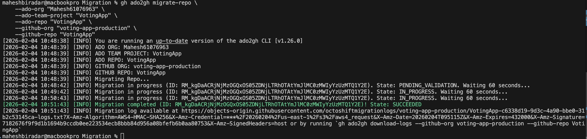
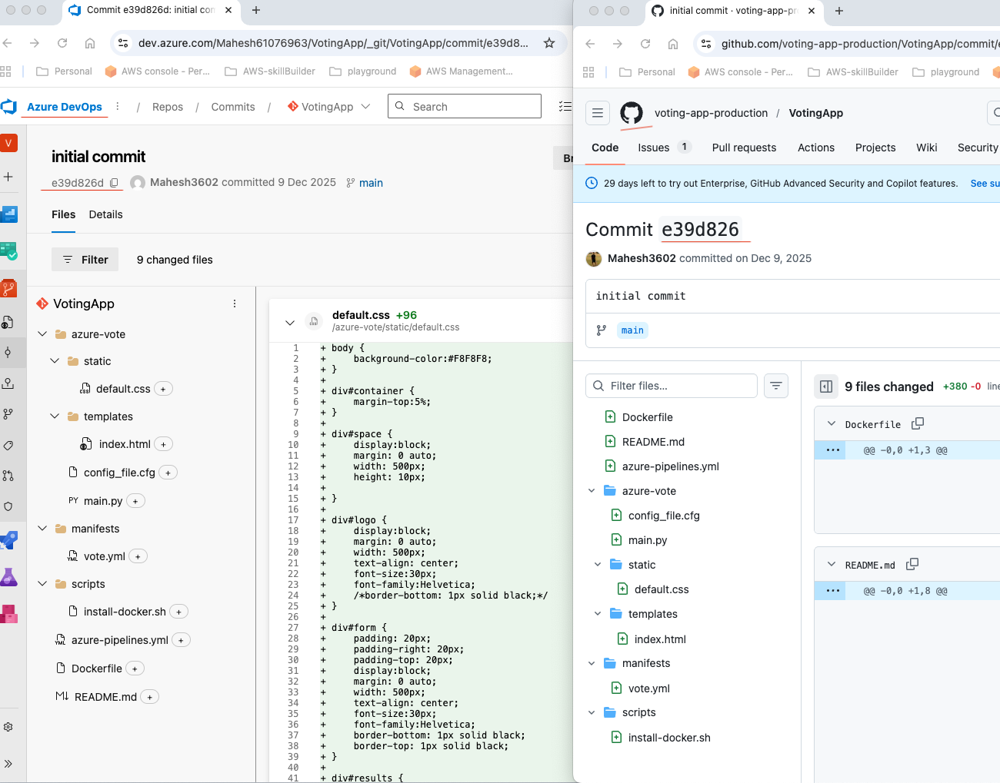
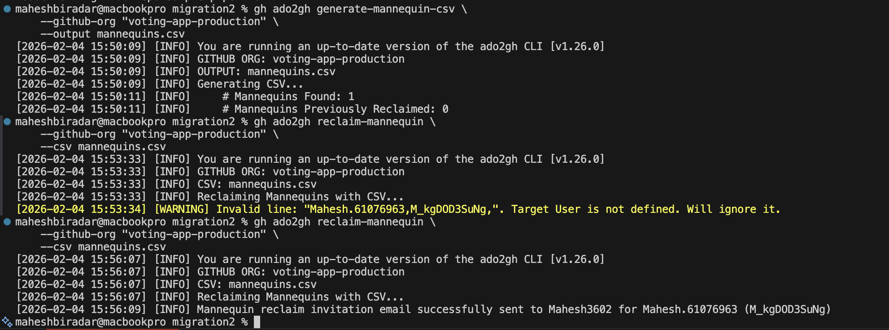
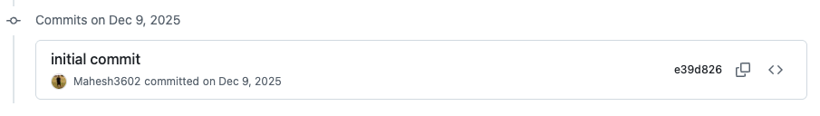
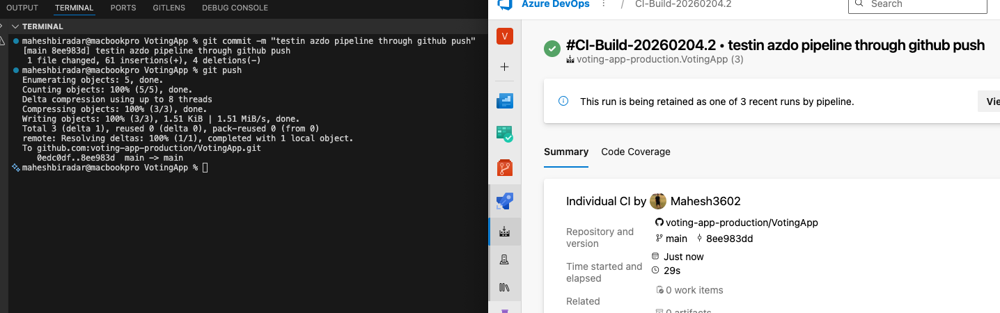

# VotingApp Migration: Azure DevOps to GitHub Enterprise

This repository represents the successful migration of the VotingApp from Azure DevOps (ADO) to GitHub Enterprise (GHE). This document summarizes the technical steps taken to move the source code, preserve history, and maintain CI/CD continuity.

# Prerequisites
- Azure DevOps:
    * Access Level: Basic access or higher in the source organization.
    * Permissions: Project Administrator or Build Administrator (to configure Service Connections and Pipelines)

- GitHub Enterprise:
    * Role: Organization Owner or a user with the Migrator role in the voting-app-production organization.

Permissions: Project Administrator or Build Administrator (to configure Service Connections and Pipelines)
# Migration Overview
- Source: Azure DevOps Services [VotingApp Project](https://dev.azure.com/Mahesh61076963/VotingApp)
- Destination: GitHub Enterprise [voting-app-production](https://github.com/enterprises/mahesh-migration-sandbox/organizations)
- Strategy: Hybrid Migration (GitHub for Source, Azure DevOps & Actions for CI/CD)

# Steps:
## 1. Installations & configuration
 - GitHub CLI
 - GEI Extension
    * gh extension install github/gh-ado2gh

 - Personal Access Tokens (PATs)
    * ADO PAT: Needs Code (Read/Write/Manage) and Identity (Read)
    * GitHub PAT: Needs repo, workflow, and admin:org 

## 2. Migration
#### Set your environment variables (Replace the values in quotes)
export GH_PAT="<ghp_your_github_token_here>"
export ADO_PAT="<your_ado_token_here>"

#### Perform the migration
--wait ensures the terminal stays open until the migration finishes

* gh ado2gh migrate-repo \
    --ado-org "<ADO_ORG>" \
    --ado-team-project "<ADO_PROJECT>" \
    --ado-repo "<ADO_REPO>" \
    --github-org "<GH_ORG>" \
    --github-repo "<GH_REPO>" \
    --wait

* Below is sample screen of successfully migrated message 
 

* Below is sample screen of commit history resemblence
 

## 3. Reclaiming Mannequin
- A mannequin is a placeholder identity used by the GitHub Enterprise Importer. It preserves the history of who did what in Azure DevOps, but it isn't linked to a real GitHub account yet.

#### Generate a Mannequin List
- Basically getting the list of users associated with the Repo
- Generate the list in CSV with below command

* gh ado2gh generate-mannequin-csv \
    --github-org "<GH_ORG>" \
    --output mannequins.csv

- Edit mannequins.csv with target-user as GitHub username

*  gh ado2gh reclaim-mannequin \
    --github-org "<GH_ORG>" \
    --csv mannequins.csv

- Sample screen of successful mannequin reclaim
 

- For Security reasons it has to be re-atrributes and approved. You finally see githu user details on commit history and other places.

##### The ado2gh tool checks for Mannequins (placeholders created during import). If you already "reclaimed" one entry, the tool thinks its job is done. However, Git Attribution (the profile picture on commits) is a separate layer. It relies on the Email inside the commit matching a Verified Email on a GitHub accoun
- you should see correct author name and email in git log
    * git log -1 --format="%an <%ae>" 
- Correct the authorname and email for proper display. After this you should be seeing correct details.
    * git filter-branch -f --env-filter '
    export GIT_AUTHOR_NAME="<correct_name>"
    export GIT_AUTHOR_EMAIL="<correct_email>"
    export GIT_COMMITTER_NAME="<correct_name>"
    export GIT_COMMITTER_EMAIL="<correct_email>"
' --tag-name-filter cat -- --branches --tags

## 4. ADO Pipeline rewiring
- To ensure zero downtime for the build process, we "rewired" our existing Azure Pipelines to listen to the new GitHub repository
- Integration: Installed the [Azure Pipelines GitHub App](https://github.com/marketplace/azure-pipelines).
- Result: Every commit pushed to GitHub now triggers action on azo pipeline.

- Below is sample screen of successful pipeline rewiring.
    * commit message is same : github-repo(left screen) --> Azdo-repo(right-screen)
  

## 5. Verification
 - most crucial metadata migration are
    * Git history - Commit SHAs remain identical (very important!).
    * Authorship - Initially shows as "Mannequins" until reclaimed.
    * Pull Requests & PR comments - PR numbers will likely change in the new repo

# Technical Challenges
- Identity Fragmentation: 
    * ADO often uses Active Directory (UPN/Email), while GitHub uses Usernames. If your ADO email is mahesh.61076963@company.com but your GitHub is mahesh3602, the metadata looks "broken" until the Mannequin Reclaiming process is finished.

- Large File Storage (LFS):
    * If your ADO repo has large binary files (>100MB) not tracked via Git LFS, GitHub will reject the push. You must convert these to LFS before migrating.

- Wiki Migration:
    * ADO Wikis are actually separate hidden Git repos. The standard migration tool often skips these, requiring a separate manual "clone and push" of the .wiki repository.

# Tools & Platform limitations
 ### A. Non-Migratable Items
 - Pipelines:
    * Azure Pipelines do not convert to GitHub Actions automatically. You keep them in ADO (Rewiring) or rewrite them from scratch

 - Permissions:
    * ADO "Security Groups" do not map to GitHub "Teams." You must rebuild your RBAC (Role-Based Access Control) in GitHub.

 - Work Item Links:
    * Links between commits and ADO Boards (Work Items) will break unless you install the "Azure Boards" app in GitHub to re-establish the link.
 
 ### B. API Rate Limits
 - If you are migrating a massive organization (hundreds of repos), GitHub and ADO both have Rate Limits
    * The Challenge: The migration might "pause" or fail halfway through if you trigger too many API calls.
    * The Fix: Run migrations in batches and use a Personal Access Token (PAT) with high-level permissions to ensure maximum "quota."

# Recommended Migration "Runbook"
- To handle these challenges, your team should follow this order of operations:
    * Cleanup: Delete "dead" branches in ADO that haven't been touched in 6+ months.
    * Dry Run: Migrate a "test" repo first to see how the metadata looks.
    * The "Freeze": Put the ADO repo in Read-Only mode so no one pushes code during the move.
    * Execute: Run gh ado2gh migrate-repo.
    * Reclaim: Map the Mannequins immediately to avoid "ghost" history.

# Additional Information
  ## Bulk repo Migration
  - Run this command to create a migration plan for an entire Azure DevOps Team Project:
    * gh ado2gh generate-script \
        --github-org "Your-GitHub-Org" \
        --ado-org "Your-ADO-Org" \
        --ado-team-project "Your-Project-Name" \
        --output "migrate_all.ps1"
    
      * * --output: This creates a file named migrate_all.ps1

  - Open the generated migrate_all.ps1 in a text editor (like VS Code). You will see a long list of commands that look like this:
    * Exec { gh ado2gh migrate-repo --ado-org "Org" --ado-repo "Repo1" ... }
        * * Filter: Delete any lines for repositories you want to archive or leave behind.
        * * Rename: You can change the --github-repo names in the script if you want them to be different from the ADO names.

    
  - Run the Script
    * ./migrate_all.ps1

  ## Migration using API
  - Migrating repositories using the GitHub REST API (specifically the GraphQL-based migration service used by the GEI tool) is a powerful way to integrate migration into your own custom internal tools.
